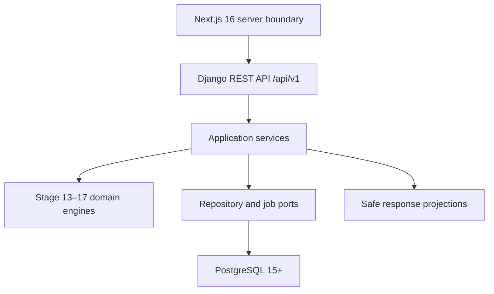

# Stage 21 Service Boundaries

**Version:** `backend-services-v1.0.0`  
**Owner:** Iman  
**Prepared:** 2026-08-09 UTC  
**Status:** Review candidate

## Architecture rule

Definitions, persisted facts, calculations and transport projections remain separate. Django 5.2 LTS and Django REST Framework 3.16+ are the selected backend adapter. Next.js 16 Active LTS is the selected Stage 22 consumer. This choice must not move mastery, selection, review or scheduling rules into Django views, serializers or Next.js code.

## Service ownership

| Service | Owns | Must not own |
|---|---|---|
| Auth | credentials, sessions, token verification, role claims | question workflow or learning calculations |
| Content | lesson/subtopic/taxonomy reads | learner state or answer keys |
| Test orchestration | Stage 13/14 selection, test snapshot, attempt lifecycle | mastery formulas or admin review decisions |
| Answer pipeline | answer validation, score event, transaction orchestration | duplicate mastery/SRS formulas |
| Error Review | Stage 16 groups, filters and retry/reveal/mark events | original attempt score or Stage 17 interval calculation |
| Mastery | Stage 15 current state and snapshots | UI labels below the confidence gate |
| Analytics | dashboard/progress projections and heavy jobs | rewriting source evidence |
| Admin | Stage 20 bank/review/import/audit operations | bypassing Stage 10/11/12 gates |

## Framework adapter boundary

- `backend.django_adapter` owns request IDs, bearer-token adaptation, coarse role permissions and uniform exception translation.
- Django models or repositories map to the existing Stage 12–21 PostgreSQL schema. They must not create a parallel user table or duplicate canonical learning tables.
- Django REST Framework serializers validate transport shapes against the OpenAPI contract. Application services remain responsible for ownership and state transitions.
- Next.js calls the API through a server-side boundary and uses OpenAPI-derived strict TypeScript types. It must not persist bearer tokens in `localStorage`.
- The frontend component system, test runner UI, responsive states and accessibility implementation remain Stage 22 deliverables.

## Answer transaction

`submitAttemptAnswer` uses one unit of work and the same idempotency record:

1. Authenticate and enforce attempt ownership.
2. Lock/read the `IN_PROGRESS` attempt and exact frozen `test_question` snapshot.
3. Validate the submitted option and ensure the original answer has not already been accepted.
4. Append `user_answers`; raw evidence is never updated in place.
5. Recompute affected Stage 15 SUBTOPIC mastery from eligible evidence and persist current state plus snapshot.
6. For a wrong scorable answer, materialize the Stage 16 item from the frozen question revision.
7. Transition the Stage 17 SUBTOPIC schedule using the Stage 15 provider contract; append the scheduling event.
8. Persist the idempotent response and commit all writes together.

Any exception before step 8 rolls back the unit of work. A storage failure is retried with the same idempotency key; a different request body with that key fails with `IDEMPOTENCY_KEY_REUSED`.

## Safe projections

The test snapshot may store the correct option and explanations internally. The learner-facing `AttemptQuestion` projection removes these recursively before submission:

- `correct_option_id`
- `is_correct`
- question/full explanation
- option explanation
- option misconception mapping
- internal selection and answer-key metadata

The answer receipt may reveal correctness for the submitted item. Full result details require `COMPLETED` status. Stage 16 explicit reveal is a separate audited event and never resolves the item by itself.

## Query and analytics boundary

- Django repository ports accept batches of IDs and return preloaded resource graphs using `select_related`, `prefetch_related` or equivalent bounded queries; adapters must not loop one query per item.
- `/dashboard` is a single aggregated resource for Stage 18 cards.
- `/progress` reads persisted `mastery_snapshots`; it never interpolates missing periods.
- Cohort rebuilds, historical backfills and staff-wide analytics create `analytics_jobs` and return `202`.
- Stage 24 owns query-count and production-like performance budgets; Stage 21 records the Django query-capture detection point.

## Admin boundary

The Stage 20 operations remain versioned under `/api/v1`. Backend authorization uses Stage 20 permissions, `CONTENT_EDITOR` maps to Stage 12 `CONTENT_AUTHOR`, and review approval requires reviewer identity different from author/generator. Import and bulk-status commits require the exact preview confirmation plus idempotency key and write both canonical `audit_logs` and linked `admin_audit_events` in the same transaction.

## Recovery and historical impact

Stage 21 adds storage; it does not rewrite question revisions, frozen tests, answers, mastery snapshots or imports. API v1 changes are additive. An incompatible schema change requires `/api/v2`, a deprecation window and a migration note covering clients, historic reports and prior import payloads.
